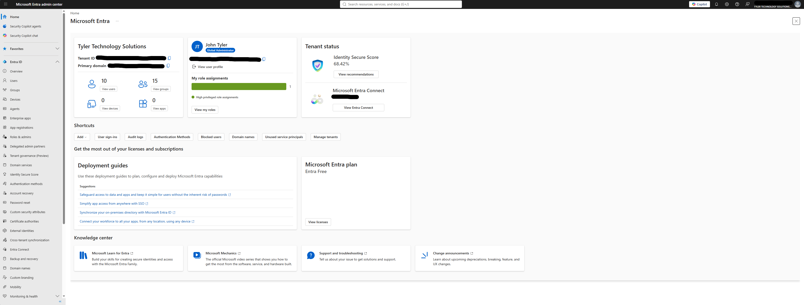
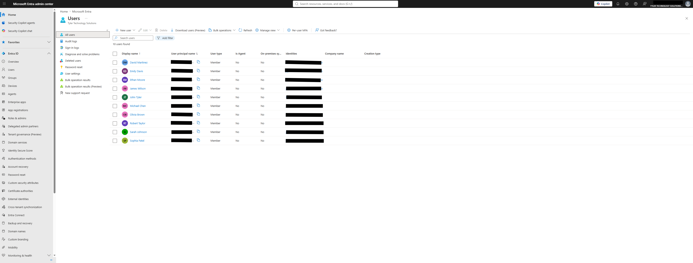
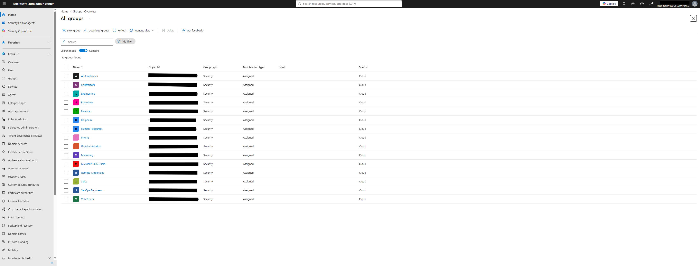

# Microsoft Entra ID Fundamentals: Tenant Deployment, User Provisioning, and Security Group Administration

## Overview

This lab demonstrates the deployment and administration of a Microsoft Entra ID (formerly Azure Active Directory) tenant by simulating the identity infrastructure of a small technology company. The environment was designed to mirror common enterprise identity management tasks performed by Help Desk Technicians, Systems Administrators, Identity & Access Management (IAM) Administrators, and Security Operations teams.

Throughout this lab, I deployed a new Microsoft Entra ID tenant, created organizational users and security groups, and structured the directory according to common enterprise best practices.

---

## Objectives

- Deploy a Microsoft Entra ID tenant
- Configure an organizational directory
- Create enterprise user accounts
- Organize users into department-based security groups
- Simulate a real-world business identity structure
- Gain familiarity with the Microsoft Entra Admin Center
- Build a reusable cloud identity environment for future labs

---

## Technologies Used

- Microsoft Entra ID
- Microsoft Entra Admin Center
- Cloud Identity Management
- Role-Based Access Control (RBAC)
- Security Groups
- Microsoft 365 Identity Platform

---

# Lab Environment

| Item | Value |
|-------|-------|
| Platform | Microsoft Entra ID |
| Portal | Microsoft Entra Admin Center |
| Tenant Name | Tyler Technology Solutions |
| License | Microsoft Entra ID Free |
| Users | 10 |
| Security Groups | 15 |
| Devices | 0 |
| Applications | 0 |

---

# Lab Tasks

## 1. Deployed a Microsoft Entra ID Tenant

The first step was deploying a new Microsoft Entra ID tenant to serve as the cloud identity provider for a fictional organization named **Tyler Technology Solutions**.

The tenant serves as the centralized identity platform responsible for:

- User authentication
- Identity management
- Group administration
- Access control
- Cloud directory services
- Microsoft 365 identity integration

### Screenshot

---

## 2. Created Enterprise User Accounts

Next, I created multiple employee accounts representing different departments within the organization.

### Users Created

| User | Role |
|------|------|
| John Tyler | IT Administrator |
| David Martinez | Security Engineer |
| Emily Davis | Sales Representative |
| Ethan Moore | IT Intern |
| James Wilson | Marketing Specialist |
| Michael Chen | Finance Analyst |
| Olivia Brown | Help Desk Technician |
| Robert Taylor | Chief Financial Officer |
| Sarah Johnson | HR Manager |
| Sophia Patel | Software Engineer |

Each account represents a real business identity and can later be used for authentication, group membership, administrative role assignments, Conditional Access policies, Microsoft 365 licensing, and future cloud administration labs.

### Enterprise Value

Organizations rarely manage identities individually. Every employee receives a dedicated identity that provides authentication, authorization, auditing, and accountability across the enterprise.

### Screenshot

---

## 3. Created Department-Based Security Groups

To simulate a production environment, I created multiple Security Groups representing departments and organizational roles.

### Security Groups Created

- All-Employees
- Contractors
- Engineering
- Executives
- Finance
- Helpdesk
- Human-Resources
- Interns
- IT-Administrators
- Marketing
- Microsoft-365-Users
- Remote-Employees
- Sales
- SecOps-Engineers
- VPN-Users

These groups provide centralized access management and allow administrators to assign permissions to groups instead of individual users.

For example:

- Finance users can receive access to accounting applications.
- VPN users can receive remote access permissions.
- IT Administrators can receive elevated administrative privileges.
- Help Desk staff can be delegated password reset capabilities.
- Executives can receive access to confidential dashboards and reporting.

### Enterprise Value

Security Groups are one of the foundational components of Identity and Access Management (IAM).

Rather than assigning permissions individually to hundreds or thousands of users, administrators assign permissions to groups and simply add or remove users as employees change roles.

This greatly simplifies administration while supporting the Principle of Least Privilege.

### Screenshot

---

# Skills Demonstrated

- Microsoft Entra ID Administration
- Cloud Identity Management
- User Provisioning
- Identity Lifecycle Management
- Security Group Administration
- Microsoft Entra Admin Center
- Role-Based Access Control (RBAC) Concepts
- Organizational Directory Design
- Enterprise Identity Architecture
- Cloud Administration

---

# Enterprise Concepts Learned

## Identity Provider (IdP)

Microsoft Entra ID acts as the organization's centralized Identity Provider responsible for authenticating users and authorizing access to enterprise resources.

---

## User Provisioning

Creating user accounts ensures every employee has an individual identity that can be authenticated, audited, and managed throughout its lifecycle.

---

## Security Groups

Security Groups simplify administration by allowing administrators to assign permissions to groups rather than individual users.

Examples include:

- Department access
- VPN authorization
- Administrative permissions
- Microsoft 365 licensing
- Application access

---

## Centralized Identity Management

Instead of maintaining separate user databases for every application, Microsoft Entra ID provides one centralized directory that can authenticate users across Microsoft 365, Azure, SaaS applications, VPNs, and enterprise systems.

---

## Least Privilege

Organizing users into department-specific security groups helps ensure employees receive only the permissions required to perform their job functions.

This reduces security risk while simplifying administrative management.

---

# Real-World Administrative Tasks Supported by This Environment

This tenant can now be expanded to perform additional enterprise identity administration tasks such as:

- Password resets
- Account lockout remediation
- User onboarding
- Employee offboarding
- Group membership management
- Administrative role assignments
- Audit log analysis
- Sign-in log monitoring
- Multi-Factor Authentication (MFA)
- Self-Service Password Reset (SSPR)
- Microsoft 365 licensing
- Enterprise application integration
- Conditional Access policy configuration
- Identity governance

---

# Why This Matters

Microsoft Entra ID is the identity platform used by organizations worldwide to manage employee identities and secure access to cloud resources.

Understanding how to deploy tenants, provision users, organize security groups, and administer cloud identities is a core competency for:

- Help Desk Technicians
- Desktop Support Engineers
- Systems Administrators
- Cloud Administrators
- Identity & Access Management (IAM) Engineers
- Security Operations Center (SOC) Analysts
- Azure Administrators

---

# Key Takeaways

Through this lab, I gained practical experience deploying and administering a Microsoft Entra ID environment from the ground up. I created a realistic enterprise identity structure by provisioning users across multiple departments, organizing them into security groups, and configuring a cloud directory that can serve as the foundation for future identity, Microsoft 365, Azure, and cybersecurity labs.

This environment will continue to be expanded in future projects involving RBAC, Multi-Factor Authentication, Conditional Access, Microsoft Intune, Microsoft 365 administration, and Identity Governance.
