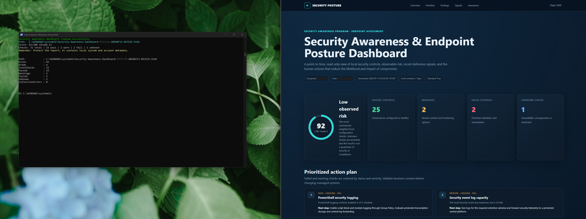
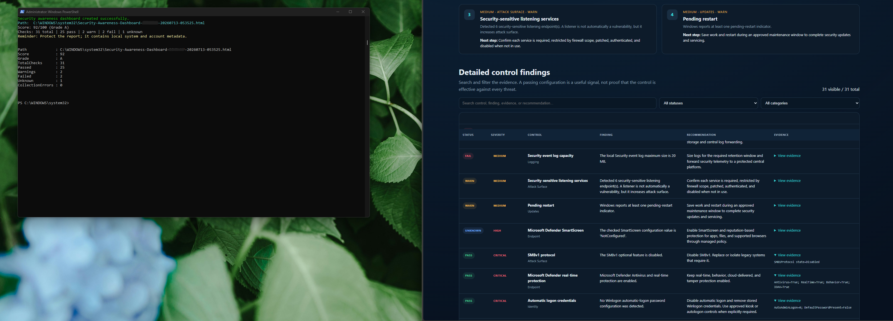
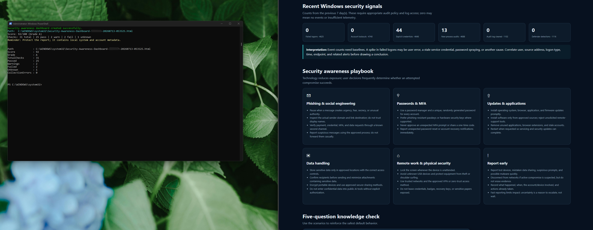
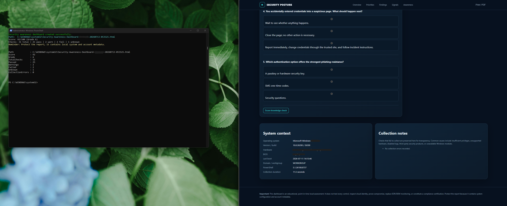

# Windows Security Awareness & Endpoint Posture Dashboard (PowerShell)

A production-style PowerShell security assessment tool that performs **31 read-only Windows security checks** and automatically generates a modern, interactive HTML dashboard summarizing endpoint security posture, prioritized remediation recommendations, Windows security telemetry, and end-user security awareness guidance.

This project demonstrates PowerShell automation, Windows security auditing, HTML/CSS/JavaScript report generation, and enterprise security reporting practices commonly used by systems administrators, security engineers, and SOC analysts.

---

## Project Overview

The script collects security configuration information directly from a Windows workstation and transforms the results into an executive-style security dashboard.

Rather than displaying raw PowerShell output, the script produces an interactive HTML report that includes:

- Overall security posture score
- Security grade
- Prioritized remediation plan
- Endpoint hardening assessment
- Windows security event summaries
- Interactive filtering of findings
- Security awareness guidance
- End-user knowledge assessment
- Evidence collected from the local system

The dashboard is designed to resemble the reporting interfaces used by enterprise security products while remaining completely standalone.

---

## Technologies Used

- PowerShell 5.1+
- Windows Security Center
- Microsoft Defender
- Windows Event Logs
- Windows Registry
- WMI / CIM
- HTML5
- CSS3
- JavaScript
- Windows Security APIs

---

# Features

## Security Posture Assessment

Performs automated security validation across multiple categories including:

- Microsoft Defender
- Windows Firewall
- SmartScreen
- User Account Control (UAC)
- BitLocker
- SMB configuration
- Windows Updates
- PowerShell logging
- Security Event Logs
- Network exposure
- Auto Logon
- Credential storage
- Remote Desktop configuration
- Attack surface reduction checks
- Windows Defender settings

---

## Interactive HTML Dashboard

Automatically generates an enterprise-style dashboard containing:

- Overall Security Score
- Letter Grade
- Pass / Warning / Fail counts
- Prioritized remediation list
- Detailed control findings
- Searchable findings table
- Security event summaries
- Awareness training content
- Interactive knowledge check
- System information
- Collection metadata

---

## Read-Only Design

The script:

- Does NOT modify Windows
- Does NOT install software
- Does NOT change security settings
- Does NOT upload data
- Does NOT require Internet access

It only gathers local configuration information.

---

# Enterprise Value

This project demonstrates practical skills used by:

- Systems Administrators
- Desktop Support Engineers
- Security Analysts
- SOC Analysts
- Windows Administrators
- Cybersecurity Engineers

Including:

- PowerShell automation
- Security auditing
- Windows administration
- Security reporting
- Endpoint hardening
- Configuration assessment
- HTML report generation
- Technical documentation

---

# Dashboard Sections

## Executive Overview

Displays:

- Overall Security Score
- Letter Grade
- Risk Level
- Passing Controls
- Warning Controls
- Failed Controls
- Unknown Checks

---

## Prioritized Action Plan

Automatically ranks findings by severity and provides remediation guidance.

Examples include:

- PowerShell logging
- Event log sizing
- Pending Windows updates
- Listening services
- Defender configuration

---

## Detailed Security Findings

Interactive table including:

- Status
- Severity
- Security Control
- Finding
- Recommendation
- Evidence

Supports searching and filtering.

---

## Windows Security Signals

Summarizes recent Windows security events including:

- Failed logons
- Account lockouts
- Explicit credential usage
- Process creation
- Audit log clearing
- Defender detections

---

## Security Awareness Playbook

Provides end-user guidance covering:

- Phishing
- Password security
- MFA
- Software updates
- Data handling
- Remote work
- Physical security
- Incident reporting

---

## Knowledge Check

Interactive security awareness quiz designed to reinforce secure user behavior.

---

# Security Controls Evaluated

Examples include:

- Microsoft Defender
- Defender Real-Time Protection
- Windows Firewall
- SmartScreen
- BitLocker
- SMBv1
- PowerShell Logging
- Event Log Capacity
- Auto Logon
- Pending Restart
- Listening Services
- RDP Configuration
- Windows Update Status
- Credential Exposure
- Local Administrator Configuration

(31 total security checks)

---

# Screenshots

## Dashboard Overview



---

## Detailed Findings



---

## Security Awareness Playbook



---

## Knowledge Assessment & System Information



---

# Example Output

After running the script:

```
Score: 92
Grade: A
Checks: 31
Passed: 25
Warnings: 2
Failed: 2
Unknown: 1
```

The script automatically creates an HTML report similar to:

```
Security-Awareness-Dashboard-COMPUTERNAME-20260713-053525.html
```

---

# Usage
## Quick Start from GitHub

Open **PowerShell as Administrator**, then download the script directly from this repository:

```powershell
Invoke-WebRequest `
  -Uri "https://raw.githubusercontent.com/johninfra/it-support-and-cybersecurity-labs/main/Lab-24-PowerShell-Security-Awareness-Dashboard/New-SecurityAwarenessDashboard.ps1" `
  -OutFile ".\New-SecurityAwarenessDashboard.ps1"

Unblock-File ".\New-SecurityAwarenessDashboard.ps1"

.\New-SecurityAwarenessDashboard.ps1 -OpenReport

Run from an elevated PowerShell session:

```powershell
.\New-SecurityAwarenessDashboard.ps1
```

Open automatically:

```powershell
.\New-SecurityAwarenessDashboard.ps1 -OpenReport
```

Specify custom output path:

```powershell
.\New-SecurityAwarenessDashboard.ps1 `
-OutputPath C:\Reports\SecurityDashboard.html `
-OpenReport
```

Customize organization name:

```powershell
.\New-SecurityAwarenessDashboard.ps1 `
-Organization "Contoso IT"
```

Analyze additional Windows event history:

```powershell
.\New-SecurityAwarenessDashboard.ps1 `
-DaysToAnalyze 14
```

---

# Learning Objectives

This project demonstrates experience with:

- Windows Security
- Endpoint Hardening
- Microsoft Defender
- Windows Event Logs
- PowerShell Scripting
- Security Automation
- Enterprise Reporting
- Security Awareness
- Technical Documentation
- Defensive Security
- Security Operations (SOC)

---

# Repository Structure

```
Windows-Security-Awareness-Dashboard
│
├── New-SecurityAwarenessDashboard.ps1
├── README.md
│
└── Screenshots
    ├── powershell-security.png
    ├── powershell-security2.png
    ├── powershell-security3.png
    └── powershell-security4.png
```

---

# Disclaimer

This project is intended for educational, laboratory, and security assessment purposes. It performs **read-only** security checks against the local Windows computer and does not modify system configuration, remediate findings, or replace enterprise security monitoring, vulnerability management, or compliance tooling.
