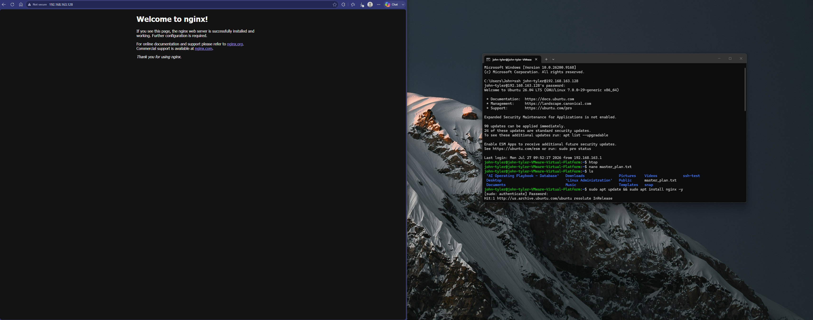
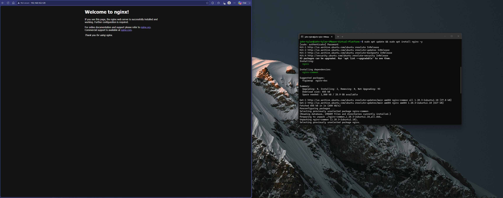
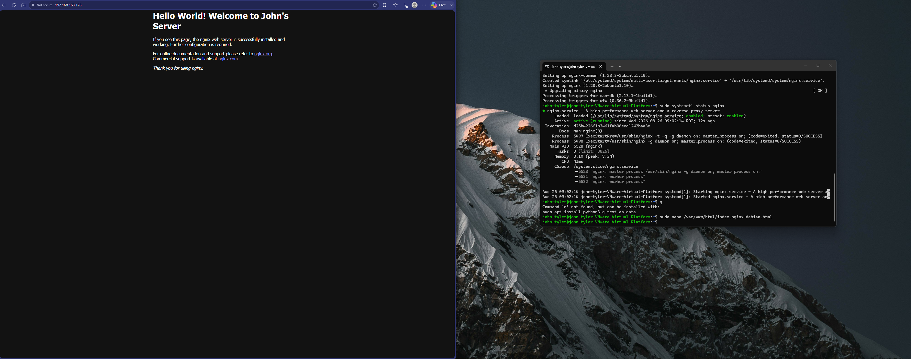
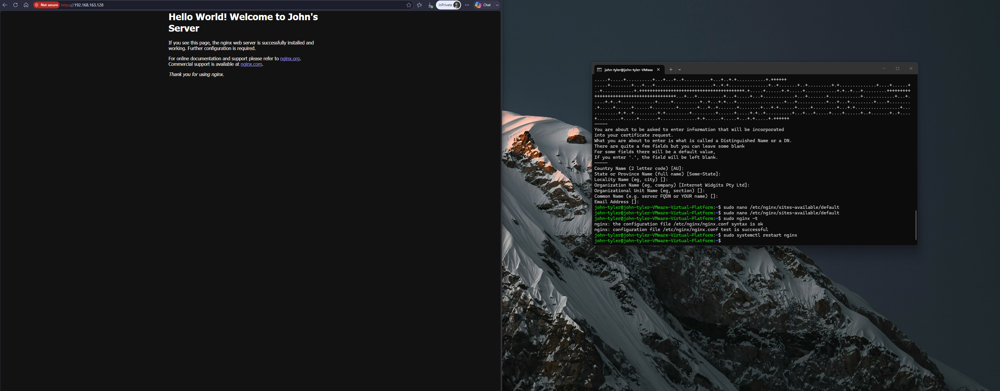
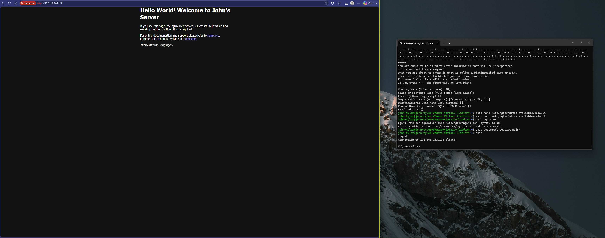

# Lab 25 - Linux Web Infrastructure and SSL/TLS Security Configuration

## Overview
This lab demonstrates the installation, customization, and securing of an Nginx web server running on an Ubuntu Linux virtual machine. 

The objective was to successfully host a custom webpage and implement a local self-signed SSL certificate to enable encrypted HTTPS communication.

## Lab Setup
* **Host Machine:** Windows Laptop
* **Virtualization:** VMware Workstation Player
* **Server Machine:** Ubuntu Linux VM (IP: 192.168.163.128)
* **Network Type:** NAT

## Tools Used
* Command Prompt (SSH Client)
* Nginx Web Server
* Nano Text Editor
* OpenSSL
* Edge Browser

## Problem Encountered
When first opening the website using `https://192.168.163.128`, the browser showed an error or crossed out the HTTPS protocol in red. This happens because the security certificate is self-signed locally rather than issued by a public trusted Certificate Authority (CA).

## Troubleshooting Steps
1. **Installed Nginx:** Ran `sudo apt update && sudo apt install nginx -y` to set up the base web server.
2. **Customized Web Content:** Used `sudo nano /var/www/html/index.nginx-debian.html` to change the default welcome text to a custom message.
3. **Generated Certificate:** Created a 2048-bit RSA key and X.509 certificate using OpenSSL.
4. **Configured HTTPS:** Edited the Nginx block using `sudo nano /etc/nginx/sites-available/default` to listen on port 443 and add the certificate file paths.
5. **Tested and Reloaded:** Ran `sudo nginx -t` to check configuration syntax and restarted the service with `sudo systemctl restart nginx`.
6. **Bypassed Browser Warning:** Clicked on "Advanced" and chose "Proceed" in the browser to view the secure site.

## Screenshots

### 1. Nginx Server Setup and Verification


### 2. Custom Web Page Creation


### 3. OpenSSL Certificate Generation


### 4. Nginx Server Configuration File Edit


### 5. Final Lab State and Session Termination


## Automation Script
To run this whole process automatically in the future, create a file named `deploy-secure-webserver.sh` and run it:

```bash
#!/bin/bash
set -e

# Update and install Nginx
sudo apt update && sudo apt install nginx -y

# Customize page text
echo "<h1>Hello World! Welcome to John's Server</h1>" | sudo tee /var/www/html/index.nginx-debian.html > /dev/null

# Generate certificate silently
sudo openssl req -x509 -nodes -days 365 -newkey rsa:2048 \
  -keyout /etc/ssl/private/nginx-selfsigned.key \
  -out /etc/ssl/certs/nginx-selfsigned.crt \
  -subj "/C=US/ST=State/L=City/O=Organization/OU=IT/CN=localhost"

# Set up configuration blocks
sudo tee /etc/nginx/sites-available/default > /dev/null << 'EOF'
server {
    listen 80 default_server;
    listen [::]:80 default_server;

    listen 443 ssl default_server;
    listen [::]:443 ssl default_server;

    ssl_certificate /etc/ssl/certs/nginx-selfsigned.crt;
    ssl_certificate_key /etc/ssl/private/nginx-selfsigned.key;

    root /var/www/html;
    index index.html index.htm index.nginx-debian.html;

    server_name _;
}
EOF

# Restart server
sudo nginx -t
sudo systemctl restart nginx
```
